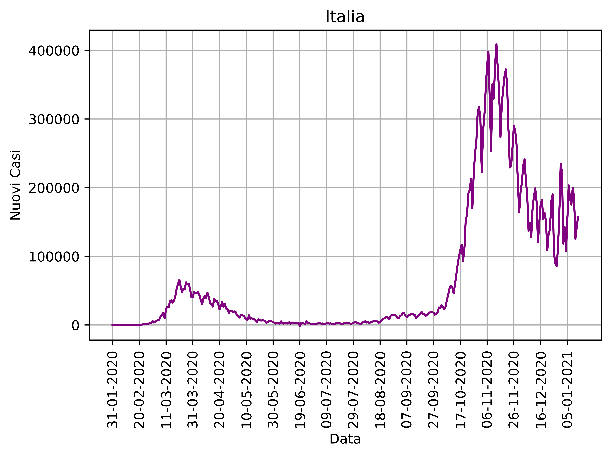
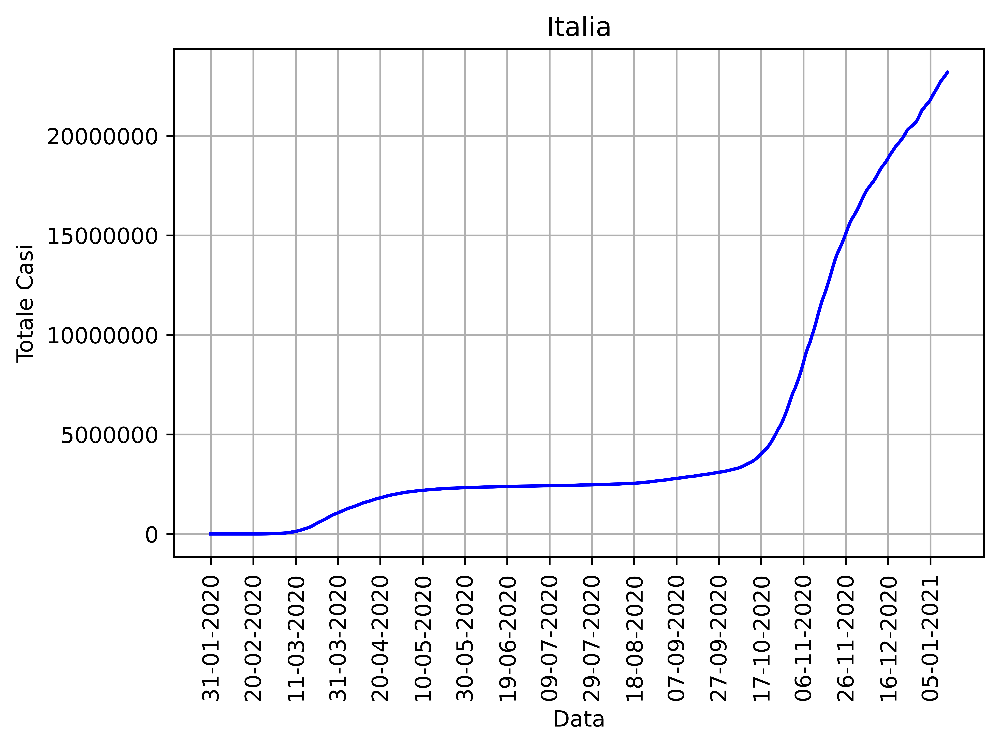

# Covid-Data-Plot

Plotting data from a .csv to make it faster and easier to read.

# DETAILS

The library used to read and manage .csv data is pandas.  
Once the .csv has been read by the python script it gets filtered.  
Only a few of the columns are actually processed in this script
The actual .csv isn't modified, the script generates only a copy of the needed columns in form of a simple list.

# NEW CASES PLOT

# TOTAL CASES PLOT

